# 01 — Modbus TCP Traffic Analysis

## Objective

Deploy Martin Scheu's `ot-lab`, observe normal HMI-to-controller Modbus TCP traffic, then correlate controlled operator actions with Modbus function codes, register addresses, and values.

This project documents my own deployment, captures, analysis, and findings. The original lab framework is by Martin Scheu and is licensed under MIT.

Original lab:
`https://gitlab.switch.ch/martin.scheu/ot-lab`

## Environment

- Windows 11
- WSL2 Ubuntu
- Containerlab
- OpenPLC v4
- FUXA HMI / SCADA
- MikroTik RouterOS gateway and distribution switch
- Wireshark

## Key Assets

| Asset | IP | Role |
|---|---|---|
| OpenPLC Runtime | `172.18.1.10` | PLC runtime |
| FUXA HMI | `172.18.1.30` | HMI / SCADA |
| SCP-1 | `172.18.1.21` | Modbus TCP slave |
| Gateway | `172.18.1.1` | MikroTik gateway/firewall |
| Distribution Switch | `172.18.1.2` | MikroTik L2 switch |

## Traffic Path Analyzed

```text
FUXA HMI 172.18.1.30
        |
        | Modbus TCP / 502
        v
SCP-1 172.18.1.21
```

## Baseline Traffic

Normal HMI polling was observed as:

```text
FC03 — Read Holding Registers
Reference Number: 0
Word Count: 28
```

The HMI polls the SCP repeatedly to refresh process values.

A response contains:

```text
28 registers × 2 bytes = 56 bytes
```

## Confirmed Register Mapping

| Register | Process Variable | Evidence | Status |
|---:|---|---|---|
| `2` | Tank Level Setpoint | FC06 writes `60 → 65 → 60` | Confirmed |
| `4` | Outlet Valve Position / Command | FC06 `100 = open`, `0 = closed` | Confirmed |
| `16` | Outlet Flow Setpoint | FC06 writes `200 → 220 → 200` | Confirmed |
| `1` | Operating Mode | FC06 `0` observed when switching to Manual | Probable |

## Example — Level Setpoint

Operator action:

```text
Level SP: 60 → 65
```

Observed on the wire:

```text
Function Code: Write Single Register (6)
Reference Number: 2
Register 2: 65
```

Then:

```text
Level SP: 65 → 60
```

Observed:

```text
Register 2: 60
```

## Example — Outlet Flow Setpoint

Operator action:

```text
Outlet Flow SP: 200 → 220 L/s
```

Observed:

```text
Function Code: Write Single Register (6)
Reference Number: 16
Register 16: 220
```

Then:

```text
Register 16: 200
```

## Example — Outlet Valve

Manual mode was used to command the outlet valve.

Open:

```text
Function Code: Write Single Register (6)
Reference Number: 4
Register 4: 100
```

Close:

```text
Function Code: Write Single Register (6)
Reference Number: 4
Register 4: 0
```

This correlates with the HMI displaying:

```text
100% = fully open
0%   = closed
```

## Security Relevance

This exercise demonstrates that passive inspection of OT traffic can reveal:

- HMI and field-device roles
- Modbus TCP communication paths
- Normal polling behavior
- Operator actions
- Process setpoint changes
- Actuator commands
- Register-to-process mappings

Useful defensive follow-up work includes:

- alerting on unexpected FC06/FC16 writes
- restricting TCP/502 to authorized source hosts
- monitoring abnormal register changes
- comparing flat vs segmented OT architecture
- building process-aware detections

## Evidence to Add

Place evidence here:

```text
pcaps/
screenshots/
```

Recommended files:

```text
pcaps/
├── baseline-modbus-polling.pcap
├── level-setpoint-write.pcap
├── outlet-flow-setpoint-write.pcap
└── outlet-valve-command.pcap

screenshots/
├── ot-lab-launchpad.png
├── fuxa-hmi.png
├── fc03-read-holding-registers.png
├── register-2-level-sp.png
├── register-16-outlet-flow-sp.png
└── register-4-outlet-valve.png
```

## Next Steps

- Confirm `Register 1` by capturing `Manual → Auto`
- Capture `Stop` behavior for the outlet valve
- Add Suricata / Snort detection rules for Modbus writes
- Build an OT network baseline
- Segment the flat network into zones and conduits

---

## Evidence Gallery

### Lab Deployment

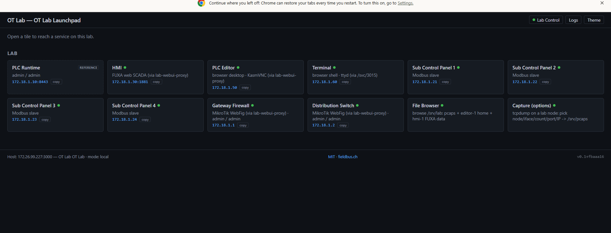

### FUXA HMI Baseline

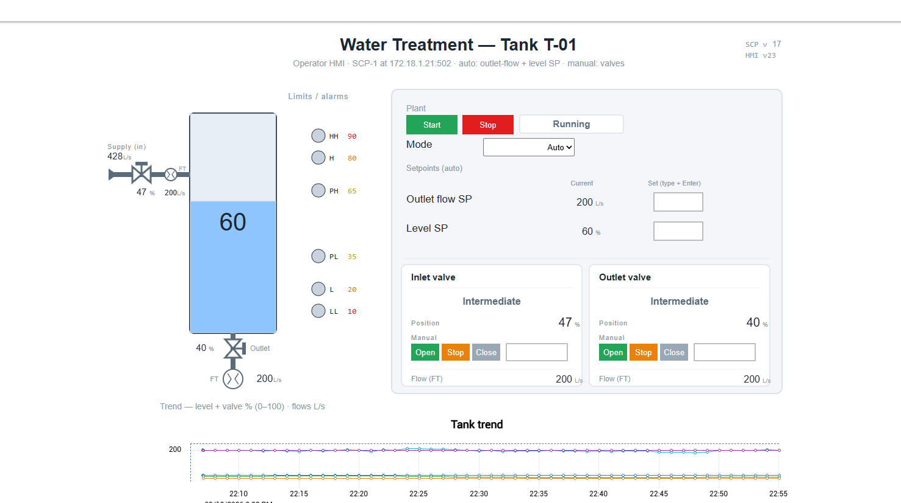

### Normal Modbus Polling — FC03

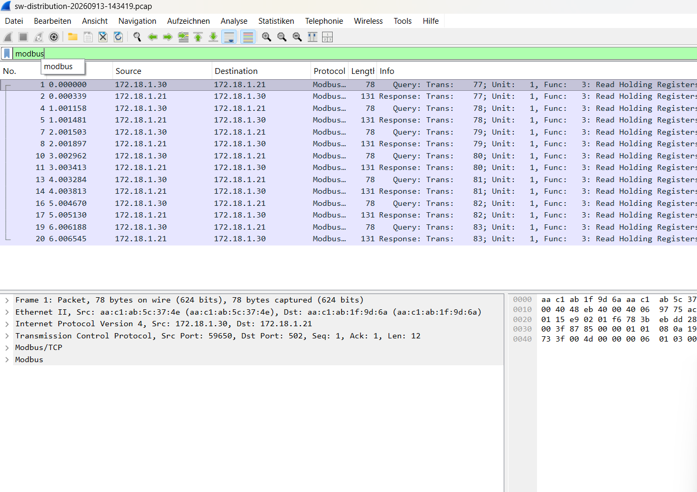

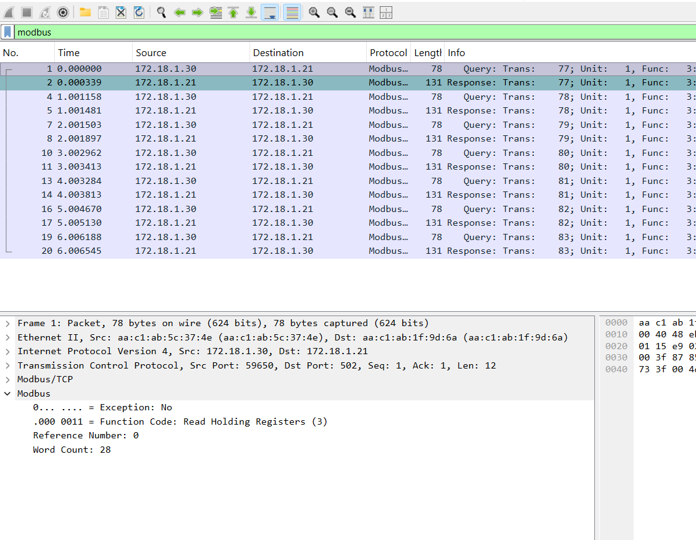

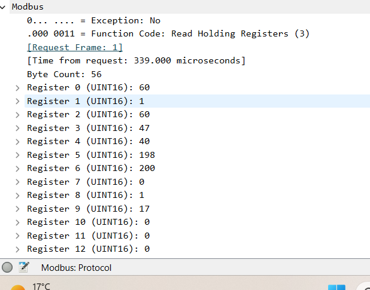

### Level Setpoint — Register 2

Operator action:

```text
60 → 65 → 60
```

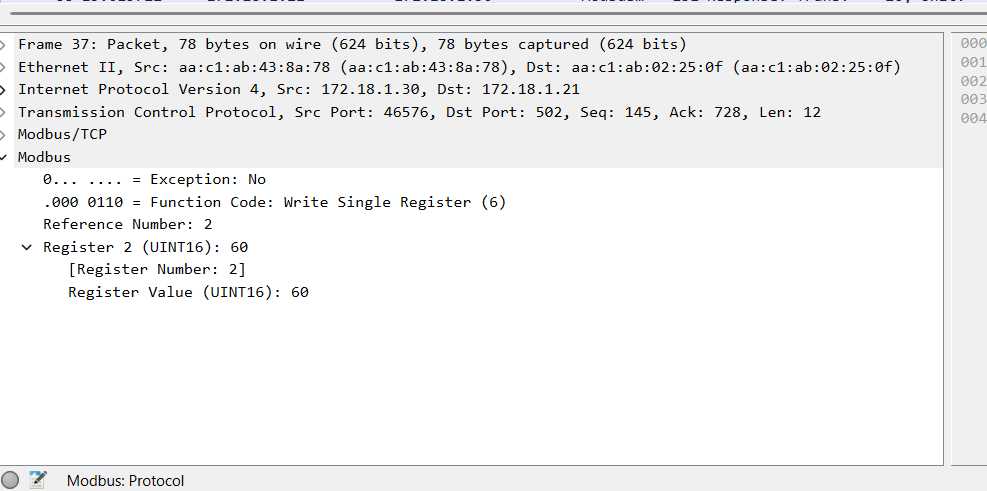

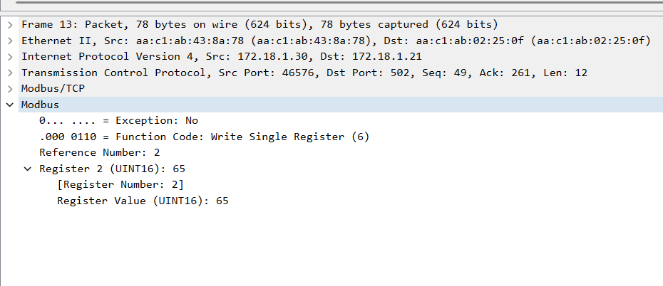

### Outlet Flow Setpoint — Register 16

Operator action:

```text
200 → 220 → 200 L/s
```

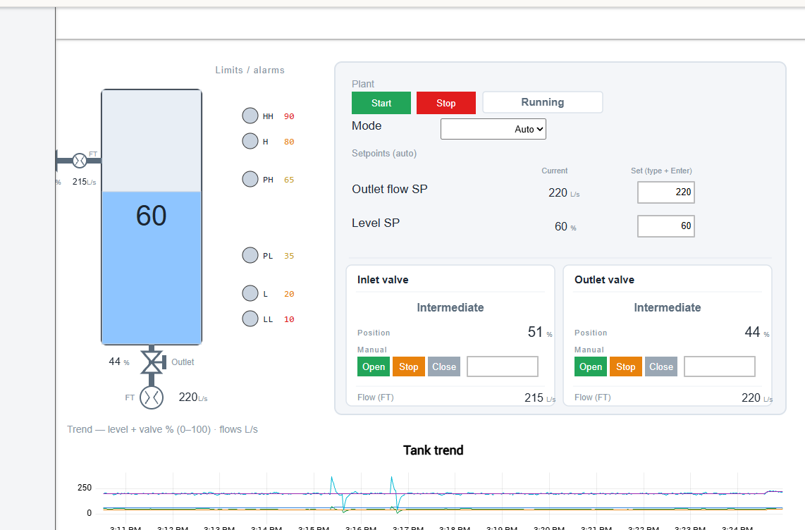

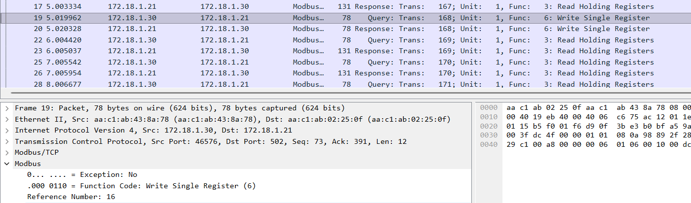

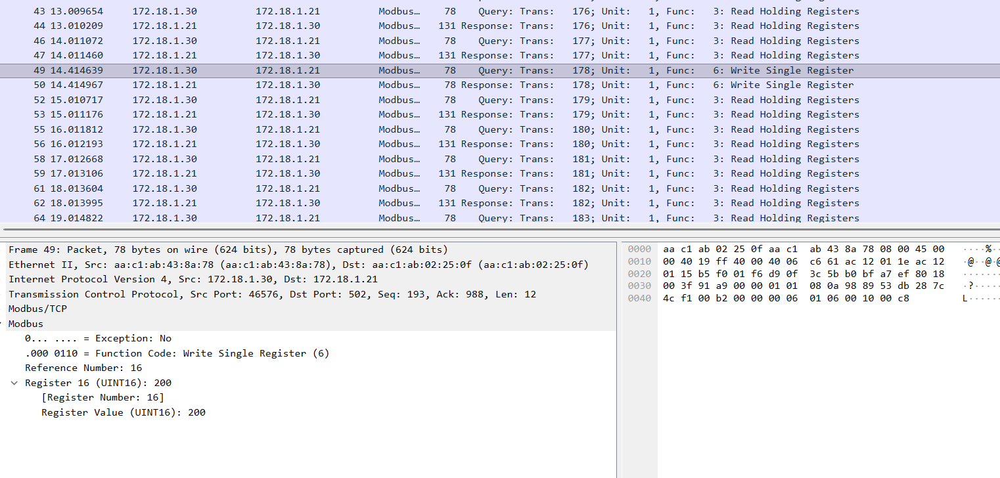

### Outlet Valve — Register 4

Confirmed behavior:

```text
Register 4 = 100 → Fully Open
Register 4 = 0   → Closed
```

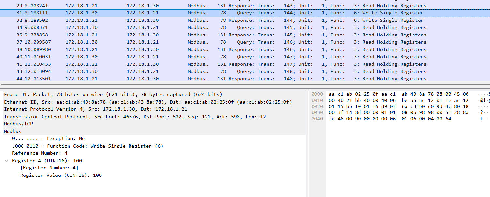

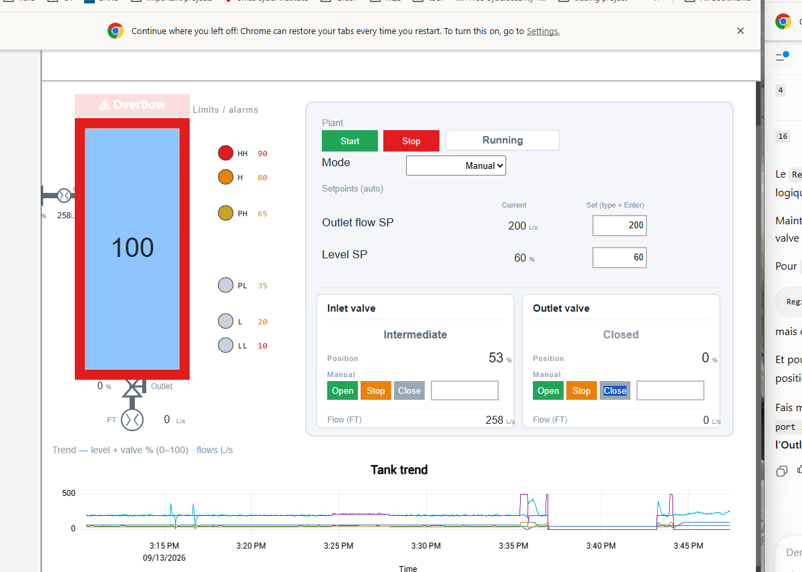

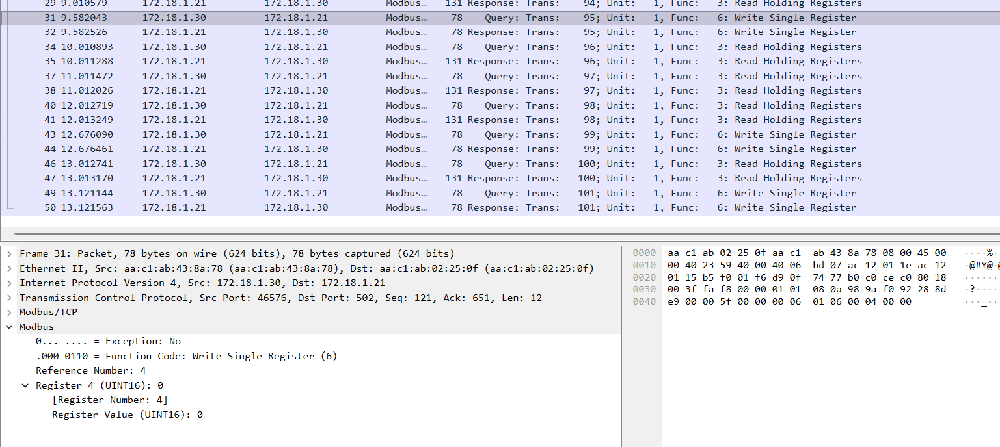

---

## Screenshot Archive

All screenshots captured during the lab session are preserved under:

```text
screenshots/raw-session/
```

The curated screenshots used as GitHub evidence are under:

```text
screenshots/evidence/
```

