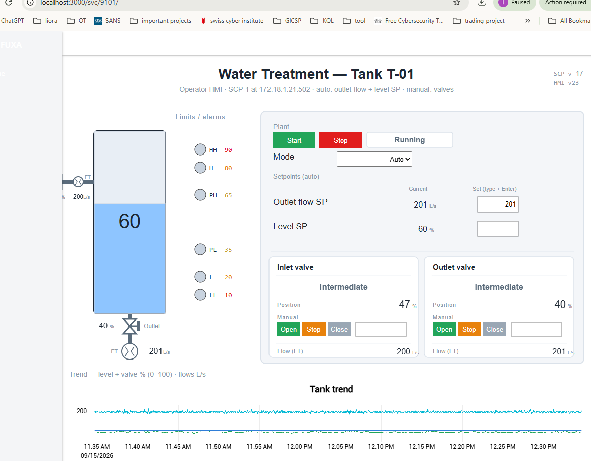
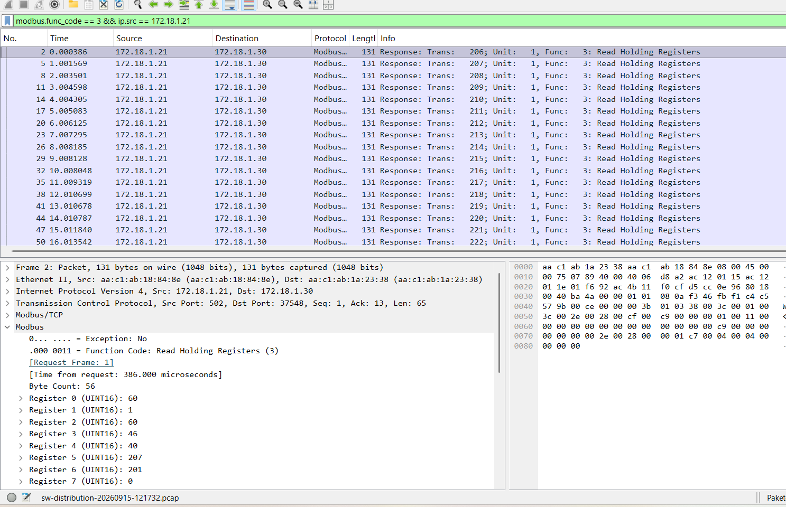
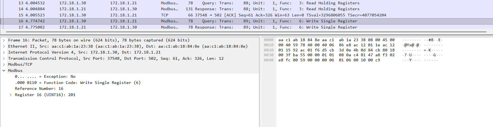
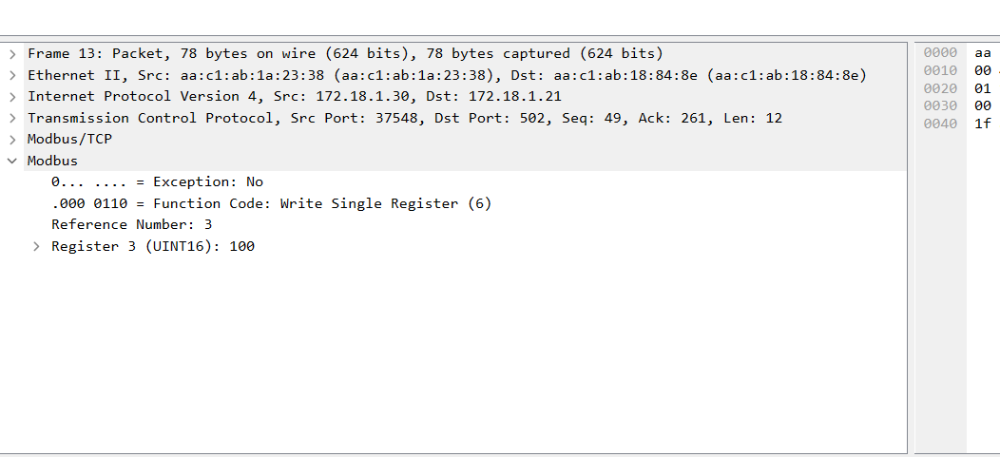
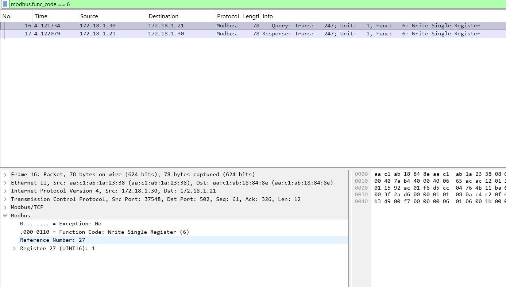

# Modbus Register & Process Mapping — OT/ICS Lab

Reverse-engineering exercise performed against the **Martin Scheu OT Lab** in a controlled local environment. The goal was to correlate HMI process variables and operator actions with the underlying **Modbus/TCP holding registers** observed in Wireshark.

> Lab source: https://gitlab.switch.ch/martin.scheu/ot-lab
>
> This repository documents analysis of a deliberately simulated training environment. It is not intended for use against production or third-party systems without authorization.

## Objective

Map HMI variables and controls to Modbus registers by combining:

1. Passive baseline capture of normal HMI polling.
2. Controlled one-variable-at-a-time HMI changes.
3. Wireshark inspection of Modbus function codes.
4. Correlation between FC03 read values and HMI process values.
5. Validation of write semantics with FC06 `Write Single Register`.

## Lab context

| Component | Address / role |
|---|---|
| HMI / Modbus client | `172.18.1.30` |
| SCP-1 / Modbus server | `172.18.1.21:502` |
| Capture point | `sw-distribution / eth4` |
| Protocol | Modbus/TCP |
| Baseline polling | FC03 — Read Holding Registers |
| Controlled writes | FC06 — Write Single Register |
| Baseline read window | Raw register addresses `0–27` |

## Confirmed / observed register map

| Raw register | Conventional 4xxxx notation* | HMI / process meaning | Example value | Access / FC | Confidence |
|---:|---:|---|---:|---|---|
| `0` | `40001` | Tank level | `60` | Read / FC03 | Strong correlation |
| `2` | `40003` | Level SP | `60 → 61` | Read/Write / FC03, FC06 | **Confirmed** |
| `3` | `40004` | Inlet valve position / command (%) | `0`, `46–51`, `100` | Read/Write / FC03, FC06 | **Confirmed** |
| `4` | `40005` | Outlet valve position / command (%) | `0`, `40`, `100` | Read/Write / FC03, FC06 | **Confirmed** |
| `5` | `40006` | Inlet flow (FT) | `~198–207 L/s` | Read / FC03 | Strong correlation |
| `6` | `40007` | Outlet flow (FT) | `201 L/s` | Read / FC03 | Strong correlation |
| `16` | `40017` | Outlet flow SP | `200 → 201` | Read/Write / FC03, FC06 | **Confirmed** |
| `26` | `40027` | Inlet valve Stop/Hold command | `1` | Write / FC06 | **Confirmed** |
| `27` | `40028` | Outlet valve Stop/Hold command | `1` | Write / FC06 | **Confirmed** |

\* The `4xxxx` notation is conventional documentation shorthand. The **raw zero-based address observed on the wire is authoritative**.

## Key controlled observations

### Level SP

HMI action:

```text
60 % → 61 %
```

Observed Modbus write:

```text
Function Code: 6 — Write Single Register
Reference Number: 2
Register 2 (UINT16): 61
```

### Outlet Flow SP

HMI action:

```text
200 L/s → 201 L/s
```

Observed Modbus write:

```text
Function Code: 6 — Write Single Register
Reference Number: 16
Register 16 (UINT16): 201
```

### Inlet valve

```text
Open  → Register 3 = 100
Close → Register 3 = 0
Stop  → Register 26 = 1
```

FC03 polling also showed Register 3 tracking intermediate HMI positions in the ~46–51% range.

### Outlet valve

```text
Open  → Register 4 = 100
Close → Register 4 = 0
Stop  → Register 27 = 1
```

FC03 polling showed Register 4 at the same intermediate position displayed by the HMI (for example `40`).

## Why this matters

This lab demonstrates practical OT/ICS analysis skills beyond simply recognizing Modbus traffic:

- Identifying Modbus client/server roles.
- Distinguishing FC03 polling from FC06 control writes.
- Understanding raw register addressing vs `4xxxx` notation.
- Correlating HMI state with fieldbus data.
- Using controlled operator actions to validate register semantics.
- Separating confirmed mappings from correlations that still need isolated validation.

## Selected visual evidence

### 1. HMI process overview



### 2. FC03 polling — process/register correlation



### 3. Outlet Flow SP — Register 16 = 201



### 4. Inlet valve Open — Register 3 = 100



### 5. Outlet valve Stop/Hold — Register 27 = 1



## Repository structure

```text
modbus-register-process-mapping/
├── README.md
├── analysis/
│   ├── methodology.md
│   └── findings.md
├── mapping/
│   └── modbus-register-map.csv
├── pcaps/
│   └── README.md
├── screenshots/
│   ├── README.md
│   ├── hmi-overview.png
│   ├── fc03-register-snapshot.png
│   ├── outlet-flow-sp-r16-201.png
│   ├── inlet-valve-open-r3-100.png
│   └── outlet-valve-stop-r27-1.png
└── wireshark/
    └── filters.md
```

## Evidence note

The included screenshots are selected analysis evidence from the lab session. PCAP files are intentionally not bundled here because they were not exported into this package. Add your original `.pcap` files under `pcaps/` before publishing if you want full reproducibility.
